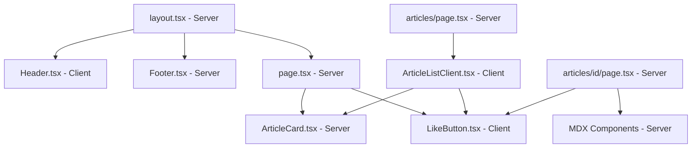
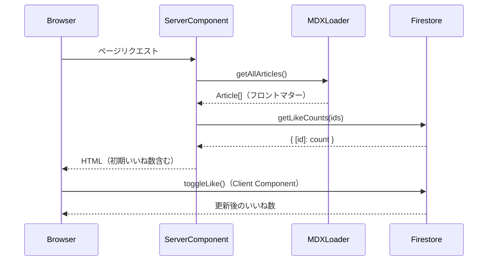

# 設計ドキュメント：rugby-media-nextjs

## Overview

本プロジェクトは、既存の React（Vite）製ラグビーメディアサイトを Next.js（App Router）に移行し、いいね機能・人気ラベル・ソート機能・SNS 導線などの Phase 1 MVP 機能を追加する。

### 設計方針

- **Server Components ファースト**：データ取得・MDX パースはサーバーサイドで行い、インタラクティブな部分（LikeButton、ソートコントロール）のみ Client Component とする
- **MDX ファイルベースのコンテンツ管理**：`data/articles/`、`data/positions/`、`data/gallery/` 配下の MDX ファイルをビルド時に自動検出し、型付きメタデータとして公開する
- **Firebase Firestore によるいいね数管理**：リアルタイム性よりも信頼性を優先し、楽観的 UI 更新を採用する
- **既存ビジュアルデザインの維持**：Tailwind CSS クラスを引き継ぎ、既存の色・レイアウトを保持する

---

## Architecture

### ディレクトリ構造

```
app/                          # Next.js App Router ルート
├── layout.tsx                # ルートレイアウト（Header, Footer）
├── page.tsx                  # ホームページ（/）
├── not-found.tsx             # 404 ページ
├── articles/
│   ├── page.tsx              # 記事一覧（/articles）
│   └── [id]/
│       └── page.tsx          # 記事詳細（/articles/[id]）
├── rules/
│   └── page.tsx              # ルール解説（/rules）
├── positions/
│   └── page.tsx              # ポジション一覧（/positions）
├── gallery/
│   └── page.tsx              # ギャラリー（/gallery）
├── about/
│   └── page.tsx              # About（/about）
└── terms/
    └── page.tsx              # 利用規約（/terms）

components/
├── Header.tsx                # ヘッダー（Client Component：モバイルメニュー）
├── Footer.tsx                # フッター（Server Component）
├── ArticleCard.tsx           # 記事カード（Server Component）
├── LikeButton.tsx            # いいねボタン（Client Component）
├── SortControl.tsx           # ソートコントロール（Client Component）
├── ArticleListClient.tsx     # 記事一覧のインタラクティブ部分（Client Component）
└── mdx/
    ├── Conversation.tsx      # MDX カスタムコンポーネント
    ├── Structure.tsx
    ├── Video.tsx
    └── CharacterCard.tsx

lib/
├── mdx.ts                    # MDX ファイル読み込み・パース
├── firebase.ts               # Firebase 初期化
└── likes.ts                  # いいね数の取得・更新

data/
├── articles/                 # 記事 MDX ファイル
├── positions/                # ポジション MDX ファイル
└── gallery/                  # ギャラリー MDX ファイル
```

### コンポーネント境界



### データフロー



---

## Components and Interfaces

### MDXLoader（`lib/mdx.ts`）

```typescript
interface ArticleFrontmatter {
  id: string;
  title: string;
  category: '解説' | '分析';
  tags: string[];
  thumbnail: string;
  excerpt: string;
  date: string;          // ISO 8601 形式
  readTime: string;
  level: '初級' | '中級' | '上級';
  team?: string;
  position?: string;
  season?: string;
  videoUrl?: string;
}

interface PositionFrontmatter {
  id: string;
  number: string;
  name: string;
  nameEn: string;
  category: 'フォワード' | 'バックス';
  description: string;
  role: string[];
  requiredSkills: string[];
  icon: string;
  character: string;
}

interface GalleryFrontmatter {
  id: string;
  title: string;
  description: string;
  coverImage: string;
  match: string;
  date: string;
  photoCount: number;
}

// ContentFrontmatter は上記の Union 型
type ContentFrontmatter = ArticleFrontmatter | PositionFrontmatter | GalleryFrontmatter;

// MDXLoader が公開する関数
async function getAllArticles(): Promise<ArticleFrontmatter[]>
async function getArticleById(id: string): Promise<{ frontmatter: ArticleFrontmatter; content: string } | null>
async function getAllPositions(): Promise<PositionFrontmatter[]>
async function getAllGallery(): Promise<GalleryFrontmatter[]>
```

### LikeButton（`components/LikeButton.tsx`）

```typescript
interface LikeButtonProps {
  articleId: string;
  initialCount: number;   // サーバーから渡す初期値
  initialLiked: boolean;  // SSR 時は false（localStorage はクライアントのみ）
}
```

**状態管理：**
- `count`：現在のいいね数（楽観的更新）
- `liked`：いいね済みフラグ（localStorage から初期化）
- `disabled`：オフライン時 true

**localStorage スキーマ：**
```
key: "liked_articles"
value: JSON.stringify(string[])  // 記事 ID の配列
```

### SortControl / ArticleListClient（`components/ArticleListClient.tsx`）

```typescript
type SortOrder = 'level' | 'popular' | 'newest';

interface ArticleListClientProps {
  articles: ArticleFrontmatter[];
  likeCounts: Record<string, number>;
}
```

ソート順の優先度：
- `level`：初級(0) → 中級(1) → 上級(2)
- `popular`：いいね数の降順
- `newest`：date の降順

### Header（`components/Header.tsx`）

Client Component（モバイルメニューの開閉状態管理のため）。

```typescript
// ロゴ画像の設定
const LOGO_IMAGE_URL = "https://images.unsplash.com/...";  // Unsplash URL
const LOGO_FALLBACK_TEXT = "Rugby Insight";
```

`next/image` の `onError` ハンドラでフォールバックテキストに切り替える。

### PopularityLabel（`components/ArticleCard.tsx` 内）

```typescript
function getPopularityLabel(likeCount: number): '注目' | '人気' | null {
  if (likeCount >= 30) return '人気';
  if (likeCount >= 10) return '注目';
  return null;
}
```

---

## Data Models

### Article（MDX フロントマター → `ArticleFrontmatter`）

| フィールド | 型 | 必須 | 説明 |
|---|---|---|---|
| id | string | ✓ | 一意の記事 ID |
| title | string | ✓ | 記事タイトル |
| category | '解説' \| '分析' | ✓ | 記事カテゴリ |
| tags | string[] | ✓ | タグ一覧 |
| thumbnail | string | ✓ | サムネイル URL |
| excerpt | string | ✓ | 記事の抜粋 |
| date | string | ✓ | 公開日（ISO 8601） |
| readTime | string | ✓ | 読了時間（例：「5分」） |
| level | '初級' \| '中級' \| '上級' | ✓ | 難易度ラベル |
| team | string | - | チーム名 |
| position | string | - | ポジション名 |
| season | string | - | シーズン |
| videoUrl | string | - | 動画 URL |

### Firestore スキーマ

```
コレクション: articles
  ドキュメント ID: {articleId}
    フィールド:
      likeCount: number  // いいね数（デフォルト: 0）
```

### localStorage スキーマ

```
キー: "liked_articles"
値: JSON 配列（string[]）
例: ["1", "3", "5"]
```

---

## Correctness Properties

*A property is a characteristic or behavior that should hold true across all valid executions of a system—essentially, a formal statement about what the system should do. Properties serve as the bridge between human-readable specifications and machine-verifiable correctness guarantees.*


### Property 1: MDX ファイル自動検出

*For any* ディレクトリに配置された有効な MDX ファイルの集合に対して、`getAllArticles()`（または対応するローダー関数）が返すリストの件数は、そのディレクトリ内の MDX ファイル数と等しくなければならない。

**Validates: Requirements 2.1, 2.2**

### Property 2: フロントマターのラウンドトリップ

*For any* 有効な MDX ファイルに対して、フロントマターをパースしてシリアライズし、再度パースした結果は、最初のパース結果と等価でなければならない。

**Validates: Requirements 2.3, 2.6**

### Property 3: 無効フロントマターのエラー検出

*For any* 必須フィールドが欠落または型不正な MDX ファイルに対して、MDXLoader はビルド時エラーを投げ、そのエラーメッセージはファイルパスと不正フィールド名を含まなければならない。

**Validates: Requirements 2.5**

### Property 4: いいねのラウンドトリップ

*For any* いいねしていない記事に対して、いいねを押してから取り消すと、いいね数は元の値に戻り、localStorage の `liked_articles` からその記事 ID が削除されなければならない。

**Validates: Requirements 3.3, 3.4**

### Property 5: localStorage からのいいね状態復元

*For any* 記事 ID の集合が localStorage の `liked_articles` に保存されている場合、ページ再読み込み後に各 LikeButton の liked 状態は localStorage の内容と一致しなければならない。

**Validates: Requirements 3.6**

### Property 6: いいね数に応じた PopularityLabel

*For any* いいね数 n に対して、`getPopularityLabel(n)` の返り値は以下の条件を満たさなければならない：n < 10 のとき null、10 ≤ n < 30 のとき「注目」、n ≥ 30 のとき「人気」。

**Validates: Requirements 4.1, 4.2, 4.3**

### Property 7: ソート順の正確性

*For any* 記事リストとソート順（レベル順・人気順・新着順）の組み合わせに対して、ソート後のリストは指定された順序の制約を満たさなければならない（レベル順：初級→中級→上級、人気順：いいね数の降順、新着順：日付の降順）。

**Validates: Requirements 5.3, 5.4, 5.5**

### Property 8: ソート変更時のフィルター維持

*For any* アクティブなフィルター（カテゴリ・タグ・ポジション）の状態でソート順を変更した場合、ソート後のリストに含まれる記事はすべてフィルター条件を満たさなければならない。

**Validates: Requirements 5.7**

### Property 9: ホームページの最新 3 記事表示

*For any* 記事リストに対して、ホームページに表示される ArticleCard の集合は、公開日の降順で上位 3 件と等しくなければならない。

**Validates: Requirements 7.2**

### Property 10: ArticleCard のリンク先

*For any* 記事に対して、その記事を表示する ArticleCard のリンク先 URL は `/articles/{article.id}` でなければならない。

**Validates: Requirements 7.5, 8.5**

### Property 11: ArticleDetail のメタ情報表示

*For any* 記事に対して、ArticleDetail のレンダリング結果はカテゴリ・レベル・読了時間・公開日・タグをすべて含まなければならない。

**Validates: Requirements 8.2**

### Property 12: 関連記事の最大件数

*For any* 記事詳細ページに対して、表示される関連記事の件数は 0 以上 2 以下でなければならない。

**Validates: Requirements 8.4**

### Property 13: Instagram リンクの属性

*For any* サイト内の Instagram リンク要素に対して、`target="_blank"` および `rel="noopener noreferrer"` 属性を持たなければならない。

**Validates: Requirements 9.4**

---

## Error Handling

### MDX パースエラー

- **ビルド時**：フロントマターの型不正・必須フィールド欠落は `throw new Error()` でビルドを停止する。エラーメッセージにはファイルパスと不正フィールド名を含める。
- **実行時**：存在しない記事 ID へのアクセスは `notFound()` を呼び出し、Next.js の 404 ページを表示する。

### Firebase / Firestore エラー

- **接続失敗**：`onSnapshot` または `getDoc` が失敗した場合、LikeButton は `disabled` 状態になり、最後に取得したいいね数を表示する。
- **書き込み失敗**：`updateDoc` が失敗した場合、楽観的更新をロールバックし、元のいいね数に戻す。
- **タイムアウト**：3 秒以内にレスポンスがない場合はオフライン扱いとする。

### 画像読み込みエラー

- **ロゴ画像**：`onError` ハンドラで `` を非表示にし、フォールバックテキスト「Rugby Insight」を表示する。
- **記事サムネイル**：`next/image` の `placeholder="blur"` または `onError` でグレーの代替表示を行う。

---

## Testing Strategy

### デュアルテストアプローチ

ユニットテストとプロパティベーステストを組み合わせて包括的なカバレッジを実現する。

- **ユニットテスト**：特定の例・エッジケース・エラー条件を検証する
- **プロパティテスト**：すべての入力に対して成立する普遍的な性質を検証する

### テストフレームワーク

| 種別 | ライブラリ |
|---|---|
| ユニットテスト | Vitest + React Testing Library |
| プロパティベーステスト | fast-check（TypeScript 対応の PBT ライブラリ） |
| E2E テスト | Playwright（オプション） |

### ユニットテストの対象

- `getPopularityLabel()` の境界値（9, 10, 29, 30）
- `sortArticles()` の各ソート順
- LikeButton の liked/unliked 状態切り替え
- Header のロゴ画像フォールバック
- 存在しない記事 ID へのアクセス（404）
- オフライン時の LikeButton 無効化

### プロパティベーステストの設定

- 各プロパティテストは最低 100 回のイテレーションを実行する
- 各テストには設計ドキュメントのプロパティ番号を参照するコメントを付与する
- タグ形式：`// Feature: rugby-media-nextjs, Property {N}: {property_text}`

#### プロパティテストの実装例

```typescript
// Feature: rugby-media-nextjs, Property 6: いいね数に応じた PopularityLabel
test('getPopularityLabel returns correct label for any like count', () => {
  fc.assert(
    fc.property(fc.integer({ min: 0, max: 1000 }), (n) => {
      const label = getPopularityLabel(n);
      if (n < 10) return label === null;
      if (n < 30) return label === '注目';
      return label === '人気';
    }),
    { numRuns: 100 }
  );
});

// Feature: rugby-media-nextjs, Property 7: ソート順の正確性
test('sortArticles preserves sort invariant for any article list', () => {
  fc.assert(
    fc.property(fc.array(articleArbitrary()), (articles) => {
      const sorted = sortArticles(articles, 'level');
      const levelOrder = { '初級': 0, '中級': 1, '上級': 2 };
      for (let i = 0; i < sorted.length - 1; i++) {
        assert(levelOrder[sorted[i].level] <= levelOrder[sorted[i + 1].level]);
      }
    }),
    { numRuns: 100 }
  );
});
```

### テストカバレッジ目標

- ユニットテスト：ビジネスロジック関数（`lib/mdx.ts`, `lib/likes.ts`）のカバレッジ 80% 以上
- プロパティテスト：設計ドキュメントの全 13 プロパティを各 1 つのプロパティテストで実装
- 各プロパティテストは設計ドキュメントの対応するプロパティを SINGLE テストで検証する
